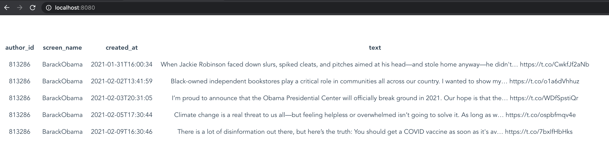

# Display Cache Webpage

I created this project to learn [Vue.js](https://vuejs.org/).

It simply displays a bunch of tweets. The [Amazon API Gateway](https://aws.amazon.com/api-gateway/)
it uses is created from **[CacheTwitterCdk](https://github.com/alexhnguyen/CacheTwitterCdk)**.



## Install

Initial package creation

```
yarn global add @vue/cli
yarn global add @vue/cli @vue/cli-service-global
vue create <project name>
yarn add axios
yarn install
```

To start the project

```
yarn serve
```

## TODO

- ~~query API Gateway using [axios](https://www.npmjs.com/package/axios), and then display it~~
- create a component for each Tweet
